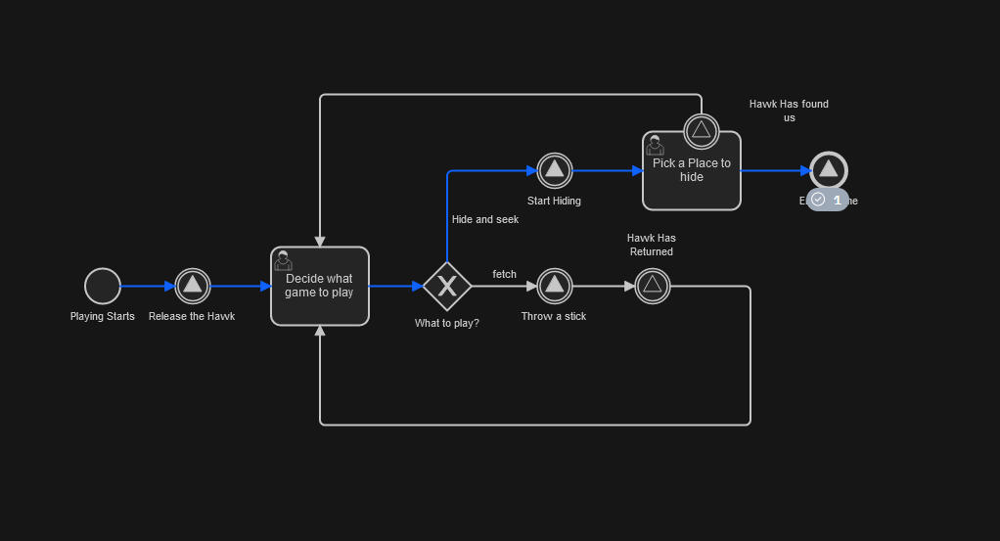
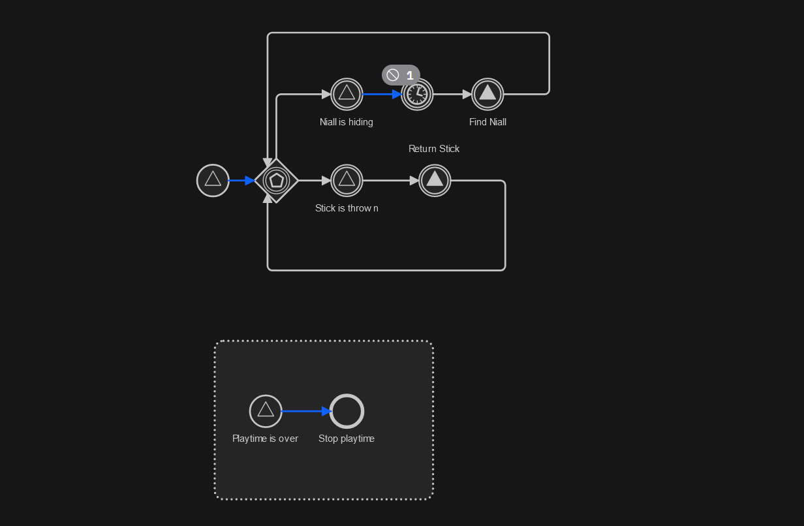

# Camunda Signal Event Example

This is an example of how you use BPMN Signal events to trigger actions between different Camunda Processes. 

For those who might be unaware of Signal events, In BPMN (Business Process Model and Notation), they are be used to broadcast a message to all running processes. 

This is done using the common process example that we can all relate to - playing with your pet hawk. This requires two processes, one representing the hawk training and the other the hawk.

The hawk trainer process will be the one we'll kick things off with.

In this process a signal first sent to release the hawk (this will start the hawk play process). After that we can decide what to do. The best way to discover is to go play for yourself.

The other process is the hawk. This process is triggered entirely by signal events.  

## How to deploy and run

The easiest way to run this is to [create a free account](https://accounts.cloud.camunda.io/signup?uc=signup) for  Camunda SaaS and [upload the BPMN models and forms to a folder](https://docs.camunda.io/docs/components/modeler/web-modeler/import-diagram/) in the web modeler and then [deploy them to a cluster](https://docs.camunda.io/docs/guides/model-your-first-process/)

Then you can start the `Niall Play Process`  this will also trigger the `Hawk Play Process` and from there you can go to the Tasklist webapp to control the flow and operate to view whats happening. 

